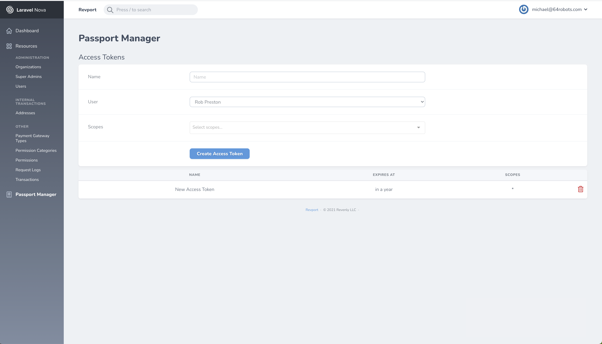

# Nova Passport Access Token Manager
Manage Laravel Passport personal access tokens.

## Requirements
- PHP >= 7.1.3
- Laravel 5.8.* (https://laravel.com)
- Laravel Nova 2.* (https://nova.laravel.com)


## Installation
1. ```sh
   composer require "64robots/nova-passport-access-tokens:*"
   ```
   
2. Add the tool to your `app\Providers\NovaServiceProvider.php`:
   ```php
    public function tools()
    {
        return [
            // ...
            new R64\NovaPassportAccessTokens\NovaPassportAccessToken\NovaPassportAccessToken,
        ];
    }
   ```

## Usage
### Nova Tools
#### Passport Management

